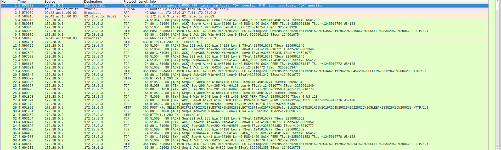
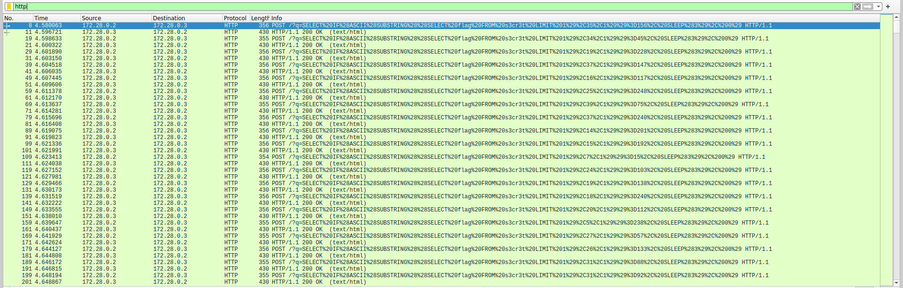

we have file .pcap here so we will use wireshark to catch packet

`wireshark dump.pcap`


filter by http


notice with the packet have "POST" method
POST /?q=SELECT%20IF%28ASCII%28SUBSTRING%28%28SELECT%20flag%20FROM%20s3cr3t%20LIMIT%201%29%2C35%2C1%29%29%3D156%2C%20SLEEP%283%29%2C%200%29 HTTP/1.1\r\n

this mean we will take the character at position 35 then compare with 156 so we can infer that it will take the character at the position
after the 12th % signto compare with the character after the 16th % sign

## Script:

```
import pyshark
import urllib.parse
import re

pcap_file = '/mnt/c/Users/BRAVO15/Downloads/CTF/sleepingshark/dump.pcap'

pattern = re.compile(
    r"SELECT IF\(ASCII\(SUBSTRING\(\(SELECT flag FROM s3cr3t LIMIT 1\),(\d+),1\)\)=([0-9]+), SLEEP\(3\), 0\)"
)

flag_chars = {}
http_requests = {}

print(f"Đang phân tích file pcap: {pcap_file}")
cap = pyshark.FileCapture(pcap_file, display_filter='http')

for pkt in cap:
    try:
        stream_id = pkt.tcp.stream

        if hasattr(pkt.http, 'request_method'):
            if hasattr(pkt.http, 'request_full_uri'):
                uri = pkt.http.request_full_uri
                http_requests[stream_id] = uri

        if hasattr(pkt.http, 'response_code') and pkt.http.response_code == '200':
            delta = float(pkt.tcp.time_delta)
            if delta >= 3.0:
                uri = http_requests.get(stream_id, '[Unknown URI]')
                parsed = urllib.parse.urlparse(uri)
                qs = urllib.parse.parse_qs(parsed.query)
                q_value = qs.get('q', [''])[0]
                q_value = urllib.parse.unquote(q_value)

                m = pattern.match(q_value)
                if m:
                    pos = int(m.group(1))
                    ascii_code = int(m.group(2))
                    char = chr(ascii_code)
                    flag_chars[pos] = char
                    print(f"Flag char at pos {pos}: '{char}' (ASCII {ascii_code})")

    except Exception:
        continue

cap.close()

flag = ''.join(flag_chars[i] for i in sorted(flag_chars))
print("\nFlag đoán được:", flag)

```

## flag:

GoN{T1mE_B4s3d_5QL_Inj3c7i0n_wI7h_Pc4p}
