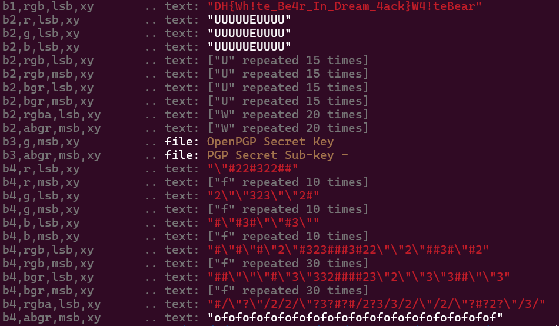

use zsteg to show Analyze and extract hidden data in PNG and BMP image files, especially through LSB (Least Significant Bit) techniques.

`zsteg whitebear.png`

output:

flag: DH{Wh!te_Be4r_In_Dream_4ack}
