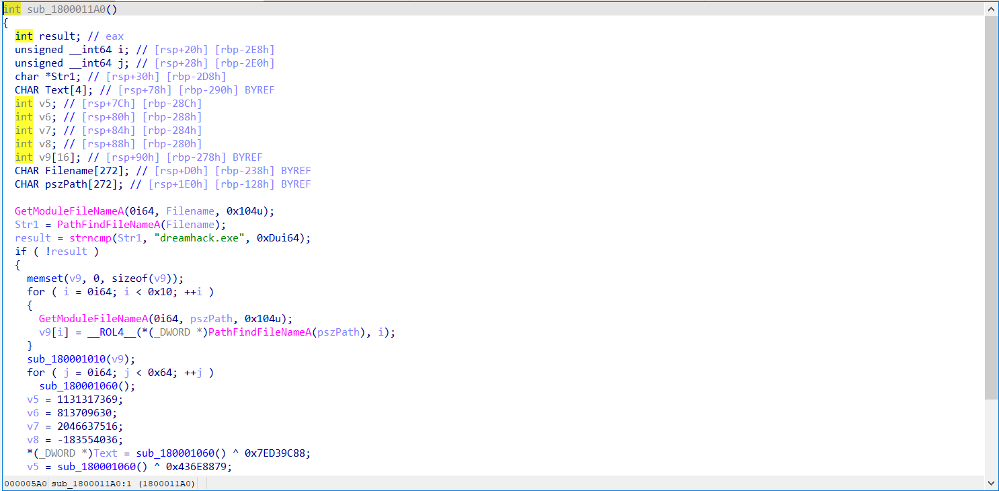

using IDA you can see:

you can see at line 18 if the file we run is "dreamhack.exe" the logic below will be executed
so we need to create the file name "dreamhack.c", complie to "dreamhack.exe" then run it

2. script
#include <windows.h>

int main() {
    // load DLL
    LoadLibraryA("prob_rev.dll");
    Sleep(3000); // let DLL runtime MessageBox
    return 0;
}

x86_64-w64-mingw32-g++ dreamhack.c -o dreamhack.exe
./dreamhack.exe

3. Flag
DH{reng@r_is_cute}