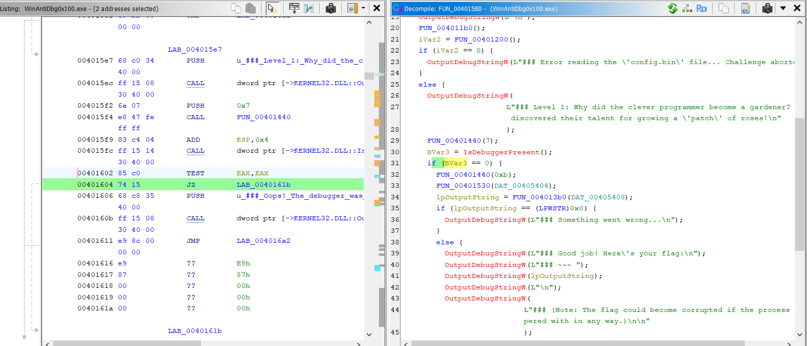
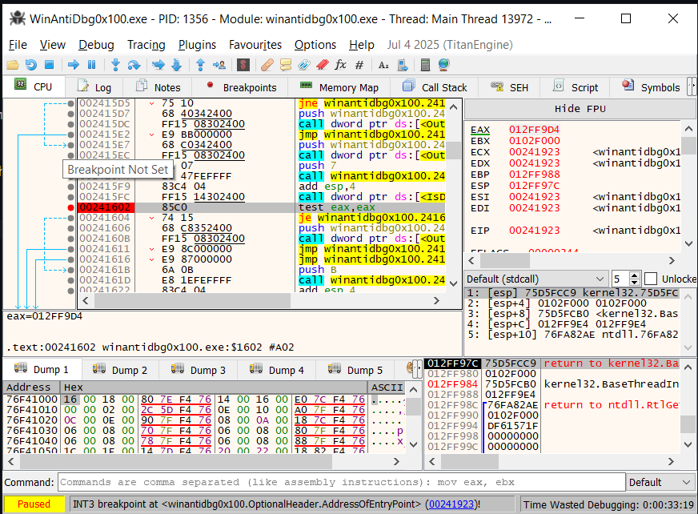

# Write up

as you can see we need to debug to this challenge so we will use ghidra and x64dbg (x32)

## in Ghidra

look at the area i circled in red, our mission is find the function that its output is the same as the picture 1

the function we need is FUN_00401580, the reason make program doesn't print flag is here

now we will debug in x64dbg to make the condition right

## in x64dbg

we will put breakpoint at the adrress ending in 1602 because the program address is not static

now you can see

we need to rewrite the eax into 0 to get in the condition

right click at eax and enter 0

## flag

the flag is:

