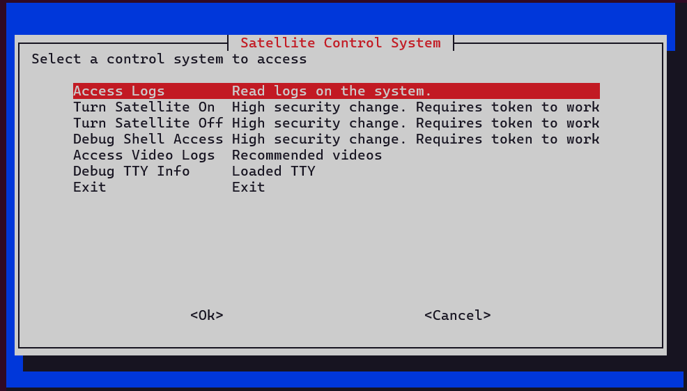
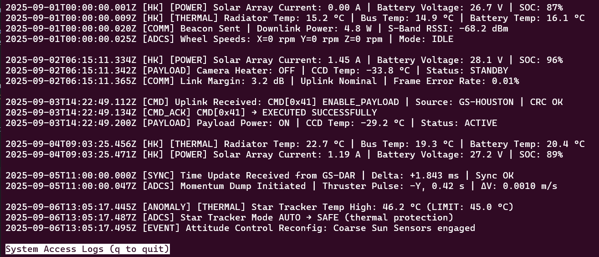
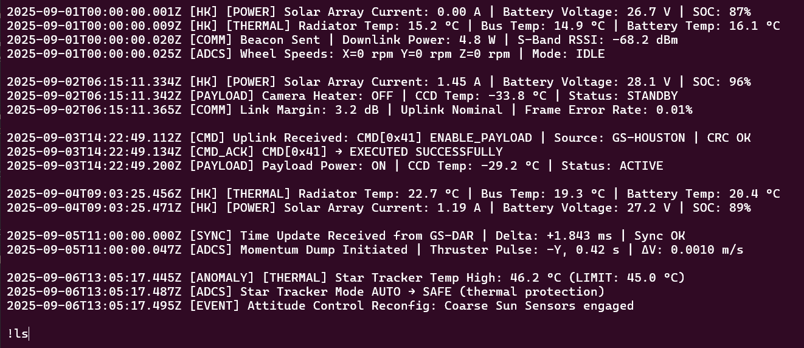
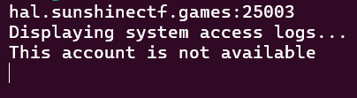
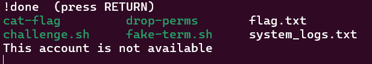

# Write up

I think i did a thing.

I may have accessed a satellite.

I can access the logs anyhow. I can't seem to access anything else.

I know I've seen that type of log viewer before, but something seems... different... about it.

Well you know the expression. Less is more!

```bash
socat file:`tty`,raw,echo=0 TCP:chal.sunshinectf.games:25003
```



Nhấn vào `Access Logs` sẽ xuất hiện cửa sổ `less`



thử dùng `!` để nhập lệnh



Kết quả là không thấy in ra



Vậy thì ta sẽ thử cách khác

sử dụng `ma` sau đó `|a` lúc này sẽ xuất hiện dấu `!` để nhập lệnh điều này có nghĩa là:

- Khi nhập ma, chương trình sẽ ghi nhớ (mark) một chuỗi/command nào đó.
- Khi nhập |a, chương trình sẽ thực thi (apply) cái đã mark đó.
- Quá trình đó sẽ trigger một đoạn code bên trong chương trình, nó in ra ký tự ! như một dạng prefix cho output (kiểu thông báo “đang thực thi command trong backend”), chứ không phải bạn trực tiếp gõ !.

Rồi thử nhập lệnh thôi. Lúc này hãy thử kiểm tra lại bằng `!<command>` để check xem lệnh đã chạy chưa

a ha!



như vậy lệnh đã được thực thi. Lặp lại quá trình trên và gọi script cat-flag để in ra flag

Flag: `sun{less-is-more-no-really-it-is-just-a-symbolic-link}`
