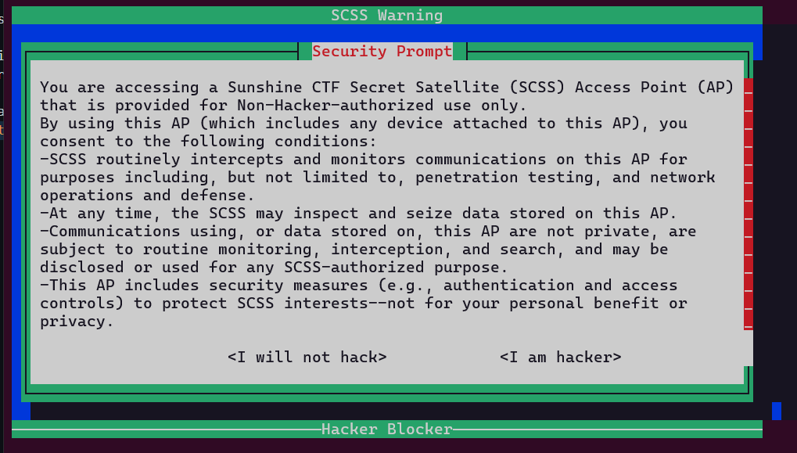
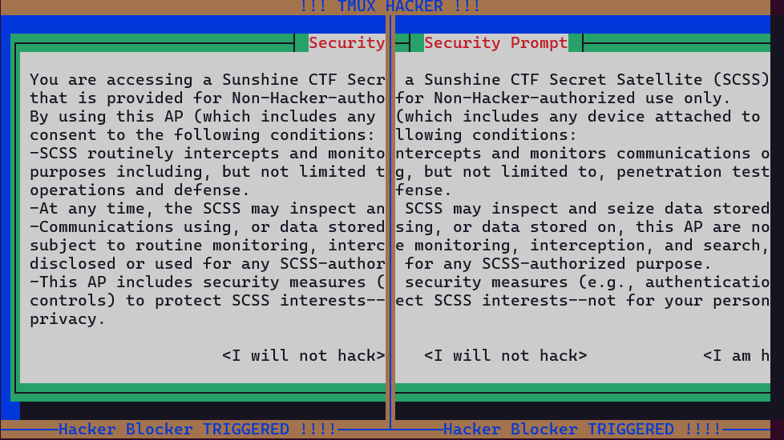
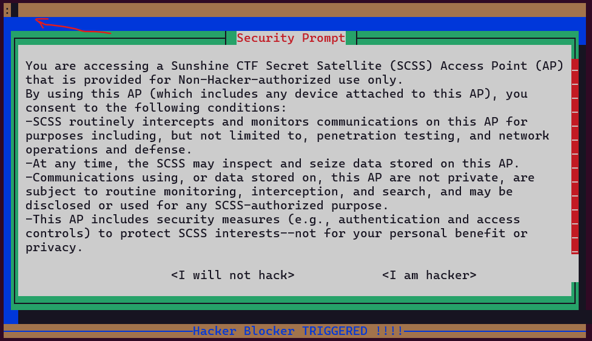

# Write up

I did it again.

This time I'm sure I accessed a satellite.

I'm scared, it's giving me a warning message when I log in.

I think this time I may have gone too far... this seems to be some top security stuff...

```bash
socat file:`tty`,raw,echo=0 TCP:chal.sunshinectf.games:25002
```



nếu ta chọn `I will not hack` thì sẽ không tmux binding không được bật nhưng
nếu ta không chọn gì cả thì keybinding sẽ hoạt động ta thử `ctrl + b` va nhập dấu `%` để chia màn hình theo chiều dọc hoặc `"` để chia theo chiều ngang



đến đây ta sẽ dùng `ctrl + b` và dấu `:` để mở command prompt



Sau đó nhập `set default-shell /bin/sh` để:

Trong tmux, mỗi khi bạn mở cửa sổ mới (new-window) hoặc pane mới (split-window), tmux phải quyết định sẽ chạy chương trình shell nào bên trong pane đó.

- Mặc định, tmux sẽ dùng shell được khai báo trong biến môi trường $SHELL của user (thường là /bin/bash hoặc /bin/zsh).

- Nếu ta đặt `set default-shell /bin/sh`, thì tmux sẽ bỏ qua $SHELL và luôn khởi chạy /bin/sh cho tất cả pane/cửa sổ mới.

Sau đó nhập `split-window` để tạo cửa sổ mới thì lúc này ta đã kích hoạt được shell

từ đó `ls -al` và chạy script `cat-flag` lấy flag

flag: `sun{wait-wait-wait-you-cannot-hack-me-you-agreed-to-not-do-that-that-is-not-fair}`
